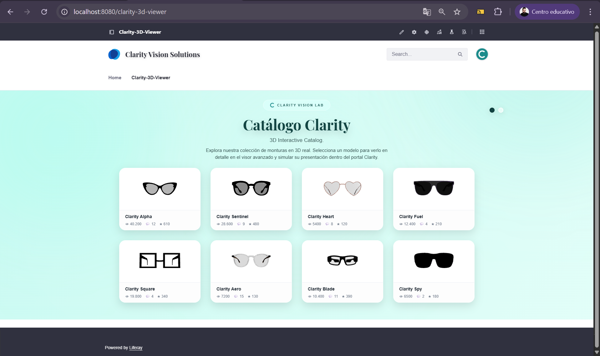
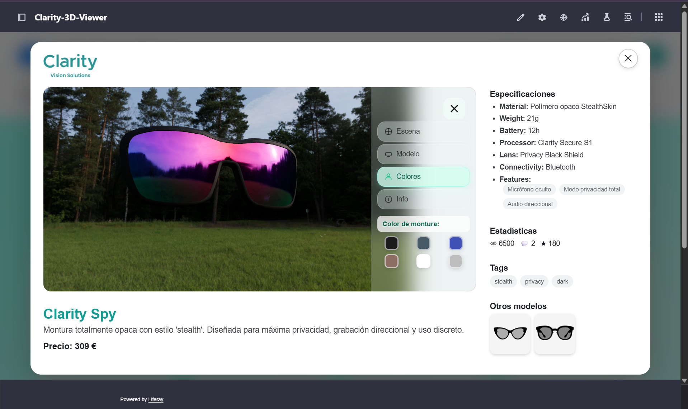

#  ProductCatalog3D-ReactThree-Liferay

Catálogo de productos **3D interactivo** desarrollado con **React** y **Three.js**, diseñado para funcionar tanto en **entorno Node (desarrollo/local)** como desplegado como **Client Extension en Liferay DXP**.

El proyecto presenta un sistema completo de **visualización 3D de productos**, con mini-visores normalizados y un visor principal avanzado, manteniendo coherencia visual independientemente del modelo 3D utilizado.

Se trata de una **DEMO TÉCNICA CENTRADA EN FRONTEND E INTEGRACIÓN VISUAL**, sin conexión a bases de datos ni uso de objetos internos de Liferay, concebida como base demostrativa y extensible para futuras integraciones backend.


---

##  Descripción general

Este proyecto implementa un **sistema completo de catálogo 3D**, aplicado en este caso a monturas de gafas, que incluye:

- Grid de **mini-visores 3D** para navegación por catálogo.
- **Visor 3D principal** para inspección detallada del producto.
- Sistema automático de **normalización de modelos GLB**:
  - Centrado inteligente
  - Escalado automático
  - Corrección de orientación  
  Esto permite incorporar nuevos modelos sin ajustes manuales.
- Interfaz moderna y limpia con:
  - Estética tipo *glassmorphism*
  - Efectos hover
  - Diseño modular y escalable
- Panel lateral interactivo:
  - Control de escena
  - Control de modelo
  - Personalización de colores
  - Ayuda de uso

El resultado es una base sólida, reutilizable y extensible para **catálogos de producto 3D en entornos corporativos**.

---

##  Tecnologías utilizadas

- **React**
- **Three.js**
- **JavaScript (ES6+)**
- **Webpack**
- **Node.js**
- **Liferay DXP (Client Extensions)**

### Uso de React en el proyecto

React se utiliza como **capa de estructuración y composición de la interfaz**, permitiendo:

- Organización del visor 3D en **componentes reutilizables** (`MiniViewer`, `ViewerLayout`, `SidePanel`, etc.).
- Gestión clara del estado visual (pestañas, controles, interacción).
- Separación entre:
  - Renderizado 3D (Three.js)
  - Lógica de interfaz
  - Datos del catálogo

No se hace uso de frameworks adicionales (Redux, Next.js, etc.), 
manteniendo una **arquitectura React sencilla y directa**, orientada a integración
en entornos corporativos como Liferay DXP.

---

##  Ejecución en Node (desarrollo / demo local)

El proyecto puede ejecutarse como "aplicación React estándar" y de forma independiente en un entorno local.

### Requisitos previos

- **Node.js** (versión LTS recomendada)

### Instalación

```bash
npm install
```

### Ejecución

```bash
npm start
```

La aplicación estará disponible en:

```
http://localhost:3000
```

Esta modalidad es ideal para:

- Revisión rápida
- Demostraciones
- Desarrollo y pruebas visuales

---

##  Release oficial (Client Extension para Liferay)

Además del código fuente, el proyecto dispone de una **Release oficial** que incluye el **ZIP final ya empaquetado**, listo para desplegar directamente en **Liferay DXP**.

▶ **Recomendado** si solo se desea probar o desplegar el visor sin necesidad de construir el proyecto.

- El ZIP **no forma parte del código fuente**
- Se distribuye mediante la sección **Releases** del repositorio  
▶ [Descargar Release v2025.12.30](https://github.com/DavidLazaro08/ProductCatalog3D-ReactThree-Liferay/releases/tag/v2025.12.30)

- Corresponde a la **versión final validada** tanto en Node.js como en Liferay DXP

---

##  Despliegue en Liferay DXP (Client Extension)

El proyecto está preparado para funcionar como **Client Extension** dentro de un **workspace de Liferay DXP**.

### Opción A — Usando el ZIP de la Release (recomendada)

1. Descargar el ZIP desde la sección **Releases** del repositorio:

▶ https://github.com/DavidLazaro08/ProductCatalog3D-ReactThree-Liferay/releases/tag/v2025.12.30

2. Copiar el archivo ZIP en la ruta:

```text
liferay-workspace/bundles/osgi/modules
```
3. Iniciar Liferay (auto-deploy).

No es necesario ejecutar Node ni realizar procesos de build adicionales.

-----------------
### Opción B — Generar el ZIP manualmente

Pensado para quien desee revisar o reconstruir el artefacto final.

```bash
npm install
npm run build
```
A continuación, generar el ZIP de la Client Extension según el flujo habitual de Liferay.

---

##  Notas de diseño

Arquitectura pensada para integración en portales corporativos:

- Separación clara entre:
  - Lógica 3D
  - Interfaz de usuario
  - Datos
- Comunicación desacoplada mediante Custom Events
- Preparado para:
  - Añadir nuevos productos
  - Integrar datos dinámicos
  - Escalar a otros contextos (catálogos técnicos, e-commerce, etc.)

---

##  Contexto del proyecto

Este proyecto se desarrolló inicialmente en un contexto de **formación corporativa y experimentación técnica**, con el objetivo de integrar **visualización 3D avanzada** dentro de **Liferay DXP** mediante **Client Extensions**.

Durante el desarrollo:

- El proyecto funcionó inicialmente **solo en entorno Node.js**.
- Posteriormente se adaptó y validó para funcionar **simultáneamente** en:
  - Ejecución local (**Node.js**)
  - Despliegue real como **Client Extension en Liferay DXP**

El repositorio actual representa la **versión unificada y final**, compatible con ambos entornos.

---

##  Capturas

### Catálogo


### Visor 3D


### Integración en Liferay



---

##  Autores

**David Gutiérrez**  
GitHub: [https://github.com/DavidLazaro08](https://github.com/DavidLazaro08)

**Miguel Benjumea**  
GitHub: [https://github.com/Benemerito86](https://github.com/Benemerito86)

---

##  Licencia

Proyecto compartido con fines educativos, demostrativos y de portfolio.
