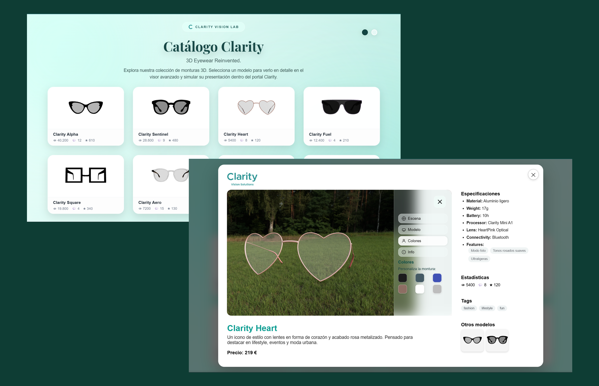
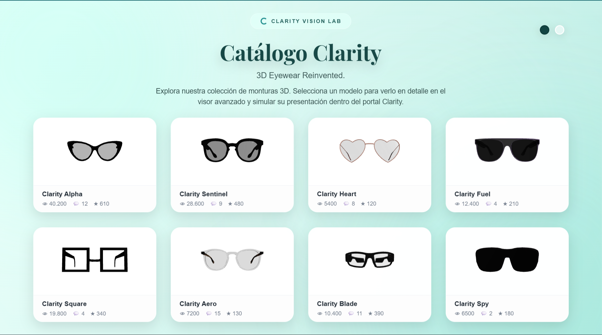

# ProductCatalog3D-ReactThree-Liferay

Catálogo de productos **3D interactivo** desarrollado con **React** y **Three.js**, diseñado para funcionar tanto en **entorno Node (desarrollo/local)** como desplegado como **Client Extension en Liferay DXP**.

El proyecto presenta un sistema completo de visualización 3D de productos, con mini-visores normalizados y un visor principal avanzado, manteniendo coherencia visual independientemente del modelo 3D utilizado.



---

## 🧩 Descripción general

Este proyecto implementa un **sistema completo de catálogo 3D**, aplicado en este caso a un conjunto de gafas, pero **totalmente agnóstico al tipo de producto**.

Incluye:

- Grid de **mini-visores 3D** para navegación por catálogo.
- **Visor 3D principal** para inspección detallada del producto.
- Sistema automático de **normalización de modelos GLB**:
  - Centrado inteligente
  - Escalado automático
  - Corrección de orientación  
  Esto permite incorporar nuevos modelos sin ajustes manuales.
- Interfaz moderna con:
  - Estilo glassmorphism
  - Efectos hover
  - Diseño modular y escalable
- Panel lateral interactivo:
  - Control de escena
  - Control de modelo
  - Personalización de colores
  - Ayuda de uso

El resultado es una base sólida, reutilizable y extensible para **catálogos de producto 3D en entornos corporativos**.

---

## 🛠️ Tecnologías utilizadas

- **React**
- **Three.js**
- **JavaScript (ES6+)**
- **Webpack**
- **Node.js**
- **Liferay DXP (Client Extensions)**

---

## 🚀 Ejecución en Node (desarrollo / demo local)

El proyecto puede ejecutarse de forma independiente como una aplicación React estándar.

### Requisitos

- **Node.js** (versión LTS recomendada)

### Instalación

```bash
npm install
```

### Ejecución

```bash
npm start
```

La aplicación estará disponible en:

```
http://localhost:3000
```

Esta modalidad es ideal para:

- Revisión rápida
- Demostraciones
- Desarrollo y pruebas visuales

---

## 🏗️ Despliegue en Liferay DXP (Client Extension)

Este proyecto incluye la versión final empaquetada como Client Extension para Liferay.

### ZIP listo para desplegar

En la carpeta:

```
release_client-extension-zip/
```

se incluye:

- El ZIP final de la Client Extension
- Un README específico con instrucciones resumidas

### Despliegue rápido (recomendado)

1. Copiar el archivo ZIP en:

```
liferay-workspace/bundles/osgi/modules
```

2. Iniciar Liferay (auto-deploy)

No es necesario reconstruir el proyecto.

### Despliegue manual (opcional)

El repositorio incluye:

- `client-extension.yaml`
- Configuración Webpack compatible con Liferay

Puede generarse nuevamente el ZIP siguiendo el flujo estándar de Client Extensions si se desea realizar pruebas o modificaciones.

---

## 🧠 Notas de diseño

Arquitectura pensada para integración en portales corporativos:

- Separación clara entre:
  - Lógica 3D
  - Interfaz de usuario
  - Datos
- Comunicación desacoplada mediante Custom Events
- Preparado para:
  - Añadir nuevos productos
  - Integrar datos dinámicos
  - Escalar a otros contextos (catálogos técnicos, e-commerce, etc.)

---

## 🏢 Contexto del proyecto

Este desarrollo se realizó en un entorno formativo corporativo, con el objetivo de explorar y validar el uso de Client Extensions en Liferay DXP combinadas con visualización 3D avanzada en React.

A diferencia de versiones anteriores, este repositorio unifica en un único proyecto funcional:

- Ejecución en Node
- Despliegue real en Liferay

---

## 📸 Capturas

### Catálogo



### Visor 3D


### Integración en Liferay


---

## 👤 Autores

**David Gutiérrez**  
GitHub: [https://github.com/DavidLazaro08](https://github.com/DavidLazaro08)

**Miguel Benjumea**  
GitHub: [https://github.com/Benemerito86](https://github.com/Benemerito86)

---

## 📄 Licencia

Proyecto compartido con fines educativos, demostrativos y de portfolio.
